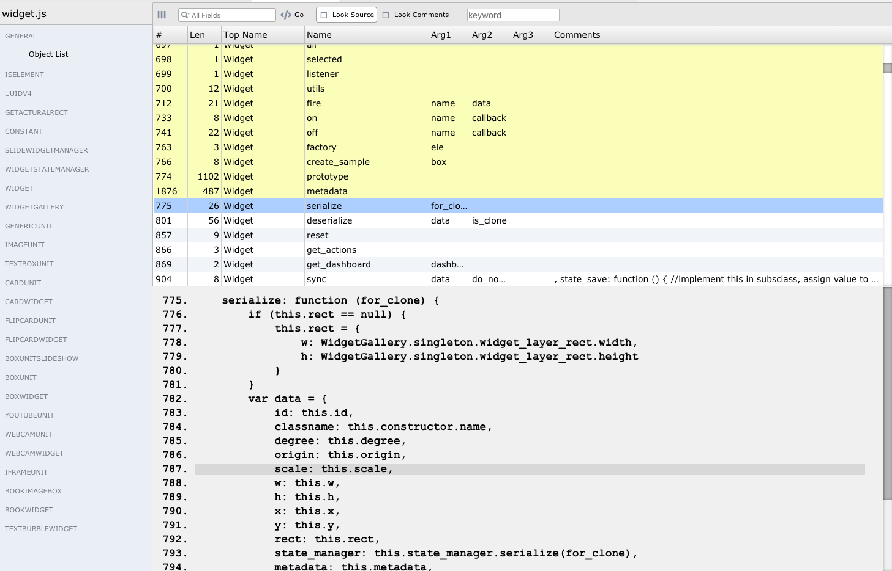

# Visual Outline

The Voutline extension is an outline generator for javascript.

##  [CMD+Shift+P] voutline: insert timestampe

- Click "🕑" on status bar, then timestamp would be inserted. It is helpful when writing comments or notes.

##  [CMD+Shift+P] voutline: visual outline

### Code Review

- Currently, it works especially for old-fashion javascript. Which means a class is created 
by ordinary function and "prototype" of that function. Because the VSCode default outline on sidebar does not work for codes in those style.

- It scan the source code to figures classes, classmethod, instance methods and comments.  Then it generate a table for them. You can compare methods of a class. Checking their arguments for consitence.

- Search a method and show where it was called. By given a keyword, it searches the source code to show you how many methods contains that keyword at the same time.

## Usages

1. For outline: When editing a .js file. Press "Shift+Command+P", then execute command "voutline: visual outline".

2. For timestamp: When editing any file.  Press "Shift+Command+P", then execute command "voutline: insert timestamp".

## Release Notes

### 1.0.0
Initial release on 2019-04-08
